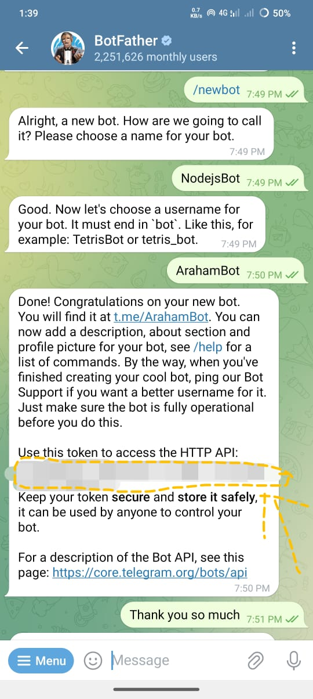
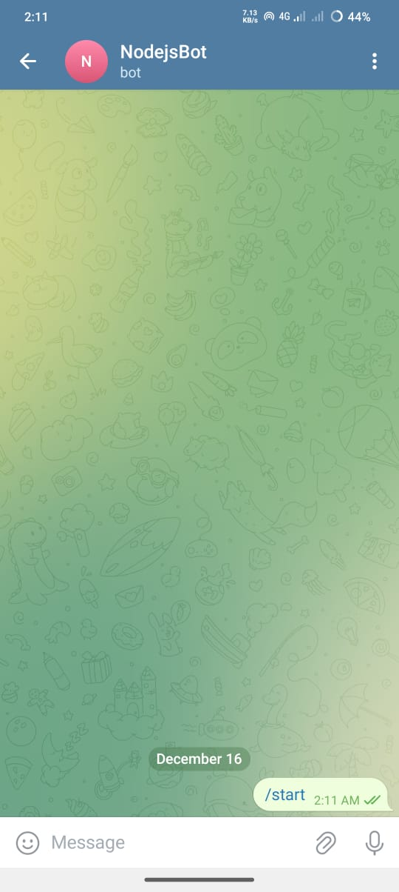
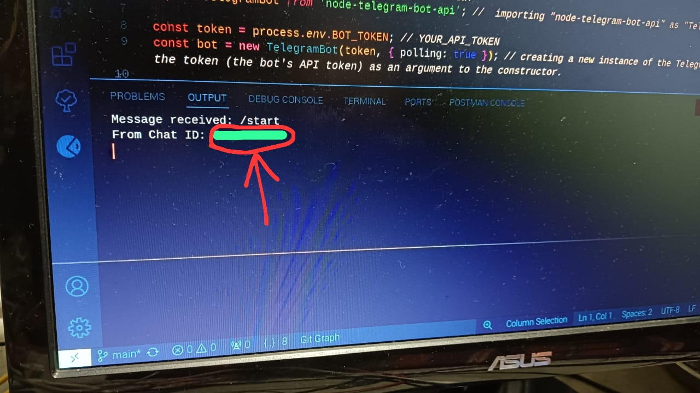

# How To Use Telegram API :---

## 1. clone the source code :---
```bash
git clone https://github.com/Araham7/Interacting-Telegram-with-Javascript-and-Nodejs.git
```

## 2. Install the required package :---
```bash
npm install
```

## 3. go to the 
```bash
cd Interacting-Telegram-with-Javascript-and-Nodejs
```

## 4. `BOT_TOKEN_Generation` : Copy the API (It is your BOT_TOKEN) , store this in ".env" , corresponding to `BOT_TOKEN=<Your-teligram-token>`


## 5. Getting `USER_CHAT_ID` : To get the user chat id you have to run the program "01-telegram-chatid-finder-of-message-sender.js" : To run program run below code in terminal =>
```bash
node 01-telegram-chatid-finder-of-message-sender.js
```

## 6. Go to the device in wich you want to send data from code , open the telegram and find the bot you have using `@username` that you have saved for your bot (in my case `@ArahamBot`) and send `any text data to the bot`, As soon as you will send text to the bot you will fild `CHAT_ID`(i.e, `USER_CHAT_ID`) printed in the terminal.

### (i). Text sent to the bot :---


### (ii). sent text response received (Your Chat_Id) :---


> `".env" file` => It allows you to keep sensitive data (like API keys, database credentials, etc.) out of your source code. This helps to avoid exposing secrets when sharing or deploying code.
## 7. Create a file(in the root directory) of the source code namely ".env" where you have to store the telegram (don't use "/' to store string just keep as it is in .env file)
```js
BOT_TOKEN=<Your-teligram-token>
USER_CHAT_ID=<Your-Chat-Id>
```

## 8. Rest of the code is easy go to the code and run the code . 
